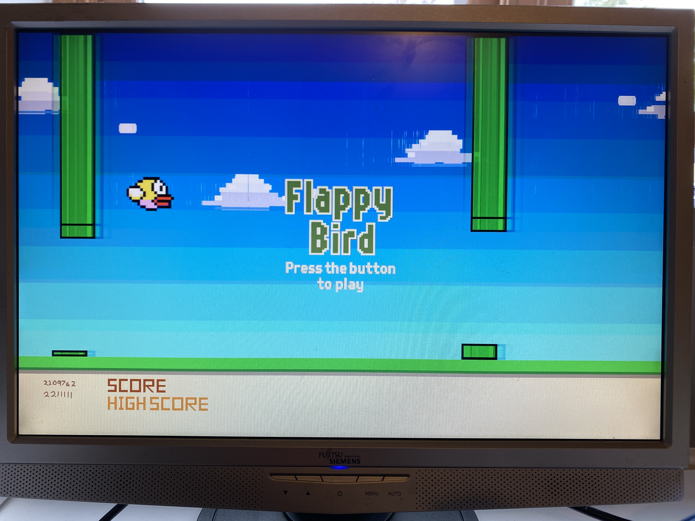

# Flappy Bird — Verilog

Flappy Bird created using Verilog on the Nexys A7 board.

## Demo

## About
A digital hardware implementation of Flappy Bird, built in Verilog and deployed to a Nexys A7 FPGA. The project applies digital design principles — combinational and sequential logic, VGA output, block memory, and peripheral integration (including accelerometer input) — taking a design from HDL through synthesis, placement, and routing to a working circuit on real hardware.

## Requirements
- Nexys A7 FPGA board
- VGA monitor
- Xilinx Vivado 2024

## Setup
1. Download all the project files.
2. Add the code to a new Vivado project.
3. Add a Clock Wizard and set it to **106.47 MHz**.
4. Add all the COE files using a Block Memory Generator. The images and COE files are included, and their names are already listed in the code.
5. Plug in a VGA monitor and program the board.

## Controls
| Action | Input |
|--------|-------|
| Start | Press BTN0 to begin |
| Flap | Press BTN0 to flap the bird upward |
| Difficulty | Set SW[0..2] before start for levels 0–3 (faster pipes) |
| Reset | After game-over, press BTN0 to restart |
| Unlock hat | Move the board quickly (accelerometer) to make a crown appear |
